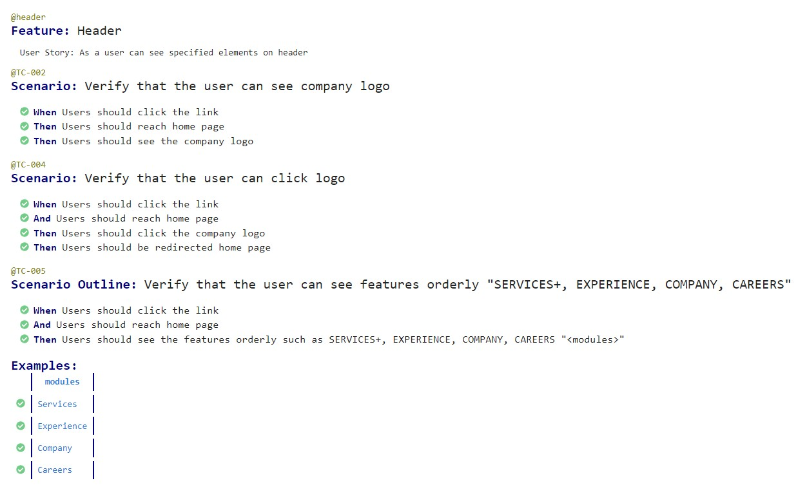
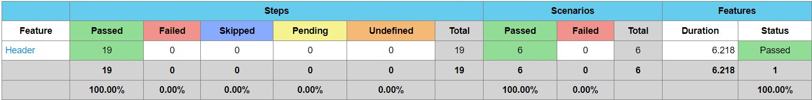
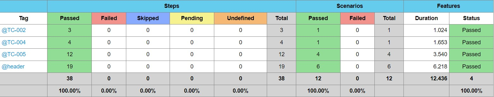

# AutomationBySerdar

This project contains 

UI Test Automation of the [BlackSmith Web Application](https://dev-bsa-dev-test.pantheonsite.io/#)

This project is developed with Java on IntelliJ.
All OOP principles are implemented. 

## This test contains these libraries and techniques

**Maven** as builder

**JUnit** as test tool

**Selenium WebDriver** as browser automation tool

**JUnit** as asserting tool

**Cucumber** with **Gherkin** Language as **BDD** tool

**Log4J** as logging tool

**Java 11** as JDK

## Fancy Cucumber HTML reports
## UI

